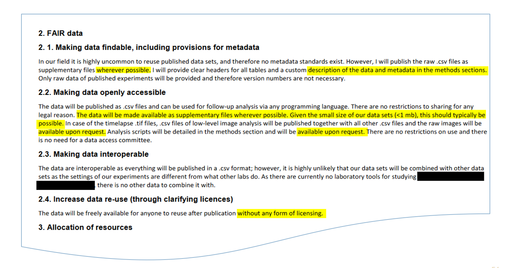
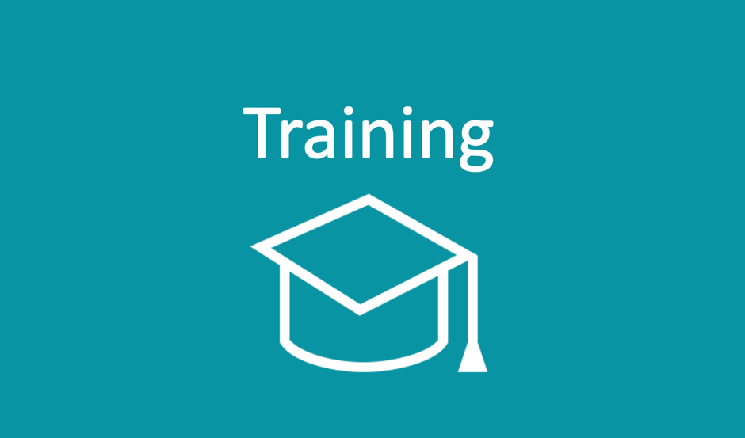
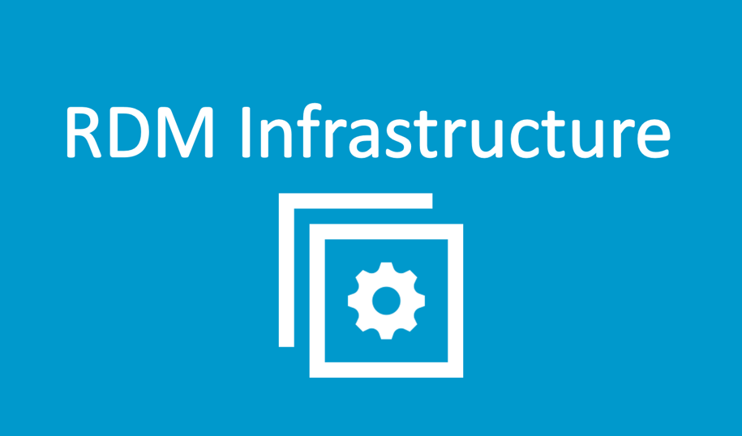
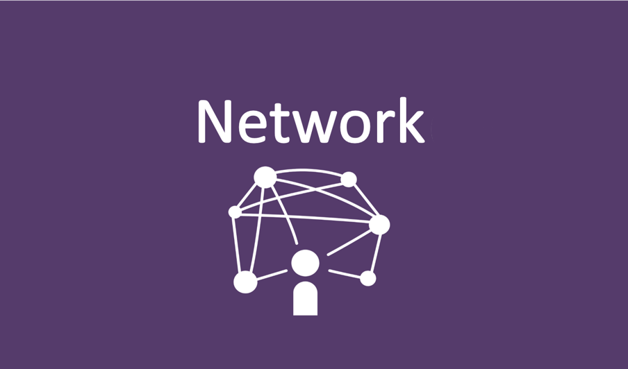

<!--

author:   Central Research Data Management of Kiel University, Britta Petersen, Linda Zollitsch

email:    zollitsch@ub.uni-kiel.de

version:  0.1.0

language: en

narrator: UK English Female

icon:     https://www.uni-kiel.de/ps/cgi-bin/logos/files/cau/norm-en/cau-norm-en-blacklila-rgb-0720.png

link: https://raw.githubusercontent.com/RDM4CAU/Intro-to-RDM/refs/heads/main/cau-style.css

comment:  This document provides a brief introduction on how to write a DMP. It provides an overview of rdm related topics as well as some didactic and methodologies for teaching rdm to students.

-->

# How to write a data management plan?

> Um dieses Dokument als interaktive, mit LiaScript gerenderte Version anzuzeigen, klicken Sie auf den folgenden Link/das folgende Symbol:
>
> 
>
> Bei Fragen wenden Sie sich bitte an uns: [Central Research Data Management](https://www.datamanagement.uni-kiel.de/de)
>
> Dieses Werk ist lizensiert unter CC-BY (https://creativecommons.org/licenses/by/4.0/)

## Einführung

### Über uns

<article>
 
## Lehrende
- Britta Petersen
- Linda Zollitsch
\

**Einrichtung**

[Central Research Data Management](https://www.datamanagement.uni-kiel.de/en?set_language=en)
</article>

### Workshop Regeln

Wir hoffen, dass wir gemeinsam eine angenehme und respektvolle Arbeitsatmosphäre schaffen können!
---

- bitte machen Sie nichts nebenbei

- nehmen Sie aktiv teil

- lassen Sie es uns wissen, wenn Sie Fragen haben

- lassen Sie einander ausreden

- helfen Sie einander

- lassen Sie Fehler zu

### Warm up

**Lassen Sie uns ein Spiel spielen…**

>Wir werden Ihnen Aussagen vorlesen.
>
>Jedes Mal, wenn Sie einer Aussage zustimmen können, stehen Sie auf. 
>
>
>Das wars!

### Orientierung
\
\

### Limitations

>Wir gehen davon aus, dass Sie mit Folgendem vertraut sind… 
>
>* die wichtigsten Begriffe und
>
>* das Grundkonzept des Forschungsdatenmanagements

* Wir werden in diesem Rahmen keinen DMP schreiben

* 

{{1}}
***********

>Hier finden Sie einige Beispiele für Lernressourcen zu den Grundlagen des Forschungsdatenmanagements:
>
>https://isis.tu-berlin.de/course/view.php?id=34606 
>
>https://www.edulabs.uni-koeln.de/goto.php?target=fold_1513&client_id=iliasedulabs 

***********

### Lernziele

Wir hoffen, dass Sie nach dem Workshop...
---

* ...die Vorteile und Bestandteile eines DMP benennen können.

* ...DMP-Vorlagen und -Tools benennen können. 

* ...DOs und DONTs hinsichtlich der Formulierung von DMP-Komponenten benennen können. 

* ...relevante CAU-Supportdienste benennen können.

* ...mit Kolleg:innen diskutiert und sich ausgetauscht haben.

## DMP Statements

### Statement 1

DMPs sparen Zeit!
---

 

{{1}}
***********

>"Frühe Planung ist die halbe Miete!“
>
>* Verantwortlichkeiten definiert
>
>* einheitliche Konventionen etabliert
>
>* Konflikte vermieden
>
>* Datenverlust verhindert

***********

### Statement 2

DMPs sparen Geld!
---

 

{{1}}
***********

>Der erste Aufwand zahlt sich aus!
>
>* gezielter Einsatz von Ressourcen
>
>* spezifische FDM-Ressourcen erwerben
>
>* Budget externe Dienstleistungen

***********

### Statement 3

DMPs werden verpflichtend!
---

 

{{1}}
***********
>**Das stimmt! :-)**
>
>EU: Open Research Europe. Data Guidelines: https://open-research-europe.ec.europa.eu/for-authors/data-guidelines
>
>DFG-Vordruck 54.01 DE: https://www.dfg.de/formulare/54_01/54_01_de.pdf
>
>DFG-form 54.01 EN: https://www.dfg.de/formulare/54_01/54_01_en.pdf

***********

### Statement 4

DMPs sind nachhaltig!
---

 

{{1}}
***********
Ein DMP enthält wertvolle Vorarbeiten für weitere Anforderungen (Ethikantrag, Verträge) und unterstützt die anschließende Kommunikation mit Dienstleistern als eine Art Ergebniskatalog (z. B. für den Datentransfer in Repositorien oder für das Verfassen von Datenverfügbarkeitserklärungen für Fachzeitschriften).

***********

## Was ist ein DMP? Funktion & Inhalt

{{0-1}}
***********

***********

{{1-2}}
***********

***********

### Administrative Daten

{{1}}
***********

**Grundlageninformationen**

* Name der Förderorganisation

* Fördernummer

* Projekttitel / Akronym

* PI /Hauptforscherende:r

* Forscher-ID (z. B. ORCID)

* Kontaktdaten der für den DMP verantwortlichen Person

* Datum der ersten DMP-Versionn

* Datum der letzten Aktualisierung

***********

{{2}}
***********
**Relevante Richtlinien / Policies**

* Anforderungen der Förderer

* fachspezifische Empfehlungen

* institutionelle Richtlinien

* Projekt- oder institutionenspezifische Policies zum Umgang mit Forschungsdaten

***********

### Datenbeschreibung

{{1}}
***********

**Art der Forschungsdaten**

* Welche Datentypen und -formate werden wiederverwendet oder neu generiert?

* Welche Werkzeuge oder Software-Tools werden verwendet?

* Sind vorhandene Daten im Hinblick auf Technologiewahl, Formate, Nutzungsrechte, Lizenzen und Metadaten für die Wiederverwendung geeignet?

***********

{{2}}
***********

**Volume**

* Schätzen Sie die zu erwartende Datenmenge ein: sowohl während der Datenanalyse als auch nach der Auswahl der Daten für die dauerhafte Archivierung.

* Wie groß sind ie größten Einzeldateien?

***********

### Datendokumentation und Qualitätskontrolle

{{1}}
***********
* Konventionen für die Benennung von Ordnern und Dateien

* Versionierung

* Metadatenstandards

* Kontrollierte Vokabulare / Ontologien

* unterstützende Dokumentation

* Virtuelle Forschungsumgebungen / Datenbanken / ELAB-Journale

***********

### Storage & Backup

{{1}}
***********
* Speicherung und Datenaustausch während des Projekts

* Backup-Strategie

* Zugriffskontrolle gemäß den Schutzanforderungen (z. B. DSGVO)

* Langzeitspeicherung

***********

### Rechtliche Aspekte

{{1}}
***********
* Datenschutz

* Urheberrechte und Nutzungsrechte

* Lizenzrecht, Patentrecht usw

>* **Aber**: aktuell gibt es **keine Rechtsberatung** vom Zentralen Forschungsdatenmanagement an der CAU! :-(

***********

{{2}}
***********

**Einige hilfreiche Ressourcen:**

* Checkliste forschungsdaten.info (EN Version [Link](https://www.forschungsdaten.info/praxis-kompakt/english-pages/legal-issues/))

* UK Data Service Platform: Intro to legal aspects of RDM ([Link](https://www.ukdataservice.ac.uk/manage-data/legal-ethical))

***********

### Datenpublikation

{{1}}
***********
* Auswahl der Datensätze

* Name des (domänenspezifischen) Repositorys

* zeitlicher Ablauf der Datenübertragung ins Archiv

* Veröffentlichungszeitpunkt (gegebenenfalls Sperrfrist)

* Grund für die Einschränkungen

* Auswahl der Nutzungslizenzen

***********

### Verantwortlichkeiten & Ressourcen

{{1-2}}
***********
**Wer ist für RDM verantwortlich?**

* Regelung der Verantwortlichkeiten

* Zugangskontrolle

* Schulung der Projektteilnehmenden

* Datenkuratierung / Qualitätskontrolle

***********

{{2-3}}
***********
**Budget: Was kostet RDM?**

☞ Planen Sie mindestens 5 % für RDM-Kosten ein!
***********

{{3-4}}
***********

See:. Jasmin Böhmer. (2019, September). UBC RDM Workshop 1 - Data Management Planning (Version V2). Zenodo. http://doi.org/10.5281/zenodo.3469953 

***********

{{4}}
***********

Adopted from.: Soßna, Volker: Wie lassen sich die Kosten für das Forschungsdatenmanagement abschätzen? Folien des Service-Teams Forschungsdaten der UH / TIB, Dezember 2018. Illustrations by Jørgen Stamp. CC BY 2.5 Denmark license www.digitalbevaring.dk

***********

## Wer? RDM-Rollen und Netzwerke

{{0-1}}
***********

***********

{{1-2}}
***********

* Datenmanager:in

* FDM-Koordinator

* Data Steward

* Data Curator

* Archivare / Dienstleister

* Forschende

* ...

***********

{{2-3}}
***********

Offizielle NFDI Website: https://www.nfdi.de/?lang=en

***********

{{3}}
***********

Offizielle FDM.SH Website: https://fdm-sh.de/

***********

## Warum? Richtlinien und Anforderungen
{{0-1}}
***********

***********

{{1}}
***********
BMBF: Individuelle Förderkriterien EC: [Aktionsplan FD](https://www.bmbf.de/de/aktionsplan-forschungsdaten-12553.html) auf deutsch

Horizon Europe
[HE Programme Guide, S.40](https://ec.europa.eu/info/funding-tenders/opportunities/docs/2021-2027/horizon/guidance/programme-guide_horizon_en.pdf)

[EC: Open Research Europe. Data Guidelines](https://open-research-europe.ec.europa.eu/for-authors/data-guidelines)

***********

### Guidelines (Germany)

DFG Guidelines
---

* [Leitlinien zur Sicherung guter wissenschaftlicher Praxis](https://zenodo.org/records/14281892)

* [Umgang mit Forschungsdaten](https://www.dfg.de/de/grundlagen-themen/grundlagen-und-prinzipien-der-foerderung/forschungsdaten)

* [Subject-Specific Recommendations (DFG-overview)](https://www.dfg.de/en/research_funding/proposal_review_decision/applicants/research_data/index.html#anker62237395)

### Guidelines (International)

* [European Code of Conduct for Research Integrity](https://allea.org/wp-content/uploads/2023/06/European-Code-of-Conduct-Revised-Edition-2023.pdf)

* Research Integrity Statements

    * [Cape-Town Statement](https://www.wcrif.org/guidance/cape-town-statement)
 * [Singapore Statement](https://www.wcrif.org/statement)

### Guidelines (Kiel University)
{{0}}
***********
Wie sieht es mit entsprechenden Richtlinien an der CAU aus?
---
***********

{{1}}
***********
**CAU:**

* [Leitlinie zum Umgang mit Forschungsdaten](https://www.praesidium.uni-kiel.de/de/dokumente/leitlinie-zum-umgang-mit-forschungsdaten)

* [Richtlinien der CAU zur Sicherung guter wissenschaftlicher Praxis](https://www.uni-kiel.de/fileadmin/user_upload/forschung/integritaet-ethik/downloads/Richtlinien-Sicherung-guter-wissenschaftlicher-Praxis.pdf)

* [Beispiel für eine projektspezifische Leitlinie: CRC 1461 Research Data Management Guide](https://www.tf.uni-kiel.de/crc1461rdm/)

**********

### FAIR Prinzipien

{{1}}
***********

FAIR konzentriert sich darauf, wie Daten nachhaltig aufbereitet werden können, sodass sie von anderen gefunden und genutzt werden können.

Forschungsdaten sind **FAIR** wenn sie auf faire Weise erstellt wurden:

- findable (auffindbar),

- accessible (zugänglich) (d. h. zumindest die Metadaten können abgerufen werden),

- interoperable (interoperabel),

- und reusable (wiederverwendbar).

FAIR-checklist: Jones, Sarah, & Grootveld, Marjan. (2017, November). How FAIR are your data?. Zenodo. http://doi.org/10.5281/zenodo.3405141 

*******

## Wie? Vorlagen & Werkzeuge

### DMP-Vorlagen
{{0-1}}
***********

> **Wie fängt man also an...? Verwenden Sie Vorlagen!**

***********

{{1-3}}
***********

**Vorlagen**

* [CAU-template](https://www.datamanagement.uni-kiel.de/de/service/materialien)

* [DFG Checklist (for section 2.4 of the proposal)](https://www.dfg.de/download/pdf/foerderung/grundlagen_dfg_foerderung/forschungsdaten/forschungsdaten_checkliste_en.pdf)

* [Volkswagen Stiftung Basic DMP (rtf-File)](https://www.volkswagenstiftung.de/sites/default/files/documents/2022-04_basic_data_management_plan.rtf)

* [EU Horizon Europe-Template](https://fdm.uni-koeln.de/sites/FDM-UzK/Templates/data-management-plan-template_he_en-2.docx)

* [Science Europe Template](https://www.scienceeurope.org/our-priorities/research-data/research-data-management/)

***********

{{2-3}}
***********

**Beispiele**

* [DFG Beispiel (CMS / HU Berlin)](https://cms.hu-berlin.de/de/ueberblick/projekte/dataman/muster-dmp-dfg)

* [BMBF Beispiel (CMS / HU Berlin)](https://www.cms.hu-berlin.de/de/dl/dataman/muster-dmp-bmbf)

* [Zenodo published DMPs (uncurated list)](https://zenodo.org/search?q=DMP&f=subject:DMP&l=list&p=1&s=10&sort=bestmatch)

***********

{{3-4}}
***********

**Basierend auf dem Forschungsdatenlebenszyklus**

* [DFG Checkliste](https://www.dfg.de/download/pdf/foerderung/grundlagen_dfg_foerderung/forschungsdaten/forschungsdaten_checkliste_de.pdf)

* [Science Europe Template (engl.)](https://www.scienceeurope.org/our-priorities/research-data/research-data-management/)

***********

{{4-5}}
***********
**Basierend auf den FAIR-Prinzipien**

* [EU Horizon Europe-Template](https://fdm.uni-koeln.de/sites/FDM-UzK/Templates/data-management-plan-template_he_en-2.docx)

***********

{{5-6}}
***********

***********

{{6-7}}
***********

Science Europe Template & Practical Guide https://www.scienceeurope.org/our-priorities/research-data/research-data-management/ 

***********

{{7}}
***********

Usually linked in the EU Funding & tenders portal.
Alternative LINKs: 
https://fdm.uni-koeln.de/sites/FDM-UzK/Templates/data-management-plan-template_he_en-2.docx 
https://enspire.science/wp-content/uploads/2021/09/Horizon-Europe-Data-Management-Plan-Template.pdf 

***********

### DMP tools

{{1}}
***********
**Generische DMP-Tools**

[Research Data Management Organizer (RDMO) - DFG-gefördert](https://rdmorganiser.github.io/)

[DMPonline - Digital Curation Centre (DDC), hosted by University of Edinburgh](https://dmponline.dcc.ac.uk/)

[DMP Tool - California Digital Library](https://dmptool.org/)

***********

{{2}}
***********
**Fachspezifische DMP-Tools**

* Biodiversitäts- und Umweltforschung: [GFBio DMP-Tool](https://www.gfbio.org/plan)

* Geistes- und Sozialwissenschaften / Sprachdaten: [CLARIN-D Wizard](https://www.clarin-d.net/de/aufbereiten/datenmanagementplan-entwickeln)

* Geowissenschaften: [MOSES DMP tool](https://moses-dmp.gfz-potsdam.de/) – Prototyp in Entwicklung

* Psychologie: [DataWiz](https://datawiz.leibniz-psychology.org/DataWiz/)

* Bildungsforschung: standardisierte DMPs ([STAMP](https://www.forschungsdaten-bildung.de/stamps-nutzen) demnächst als RDMO-Tool oder PDF-Datei verfügbar)
***********

## Übung

**Aufgabe**

>Überprüfen von Auszügen aus DMPs (ein Auszug pro Gruppe)
>
>Besprechen Sie das konkrete Beispiel – was fällt Ihnen auf?
>
> **Zeit: 10 Minutes**

### Beispiel 1

{{0}}
***********

***********

{{1}}
***********

***********

### Beispiel 2

{{0}}
***********

***********

{{1}}
***********

***********

### Beispiel 3

{{0}}
***********

***********

{{1}}
***********

***********

## Do's & Don'ts

{{0}}
***********

***********

### Häufige Fehler beim Erstellen von DMPs::

* mangelnde Genauigkeit

* Wiederverwendung von Textblöcken

* terminologische Ungenauigkeiten

* mangelnde Ressourcenberechnung

### DMP Checkliste

1. Ermitteln der Anforderungen des Forschungsförderers

2. Identifizieren der zu erfassenden Daten

3. Definieren, wie die Daten organisiert werden

4. Erläutern, wie die Daten dokumentiert werden

5. Beschreiben, wie die Datenqualität sichergestellt wird

6. Eine solide Datenspeicherungs- und -erhaltungsstrategie vorstellen

7. Die Datenrichtlinien des Projekts definieren

8. Beschreiben, wie die Daten verbreitet werden

9. Rollen und Verantwortlichkeiten zuweisen

10. **Erstellen eines realistischen Budgets**

Michener WK (2015) Ten Simple Rules for Creating a Good Data Management Plan. PLoS Comput Biol 11(10): e1004525. 
https://doi.org/10.1371/journal.pcbi.1004525 

## CAU Services

{{0-1}}
***********

website: https://www.datamanagement.uni-kiel.de/en?set_language=en 

e-mail: info@fdm.uni-kiel.de  

***********

{{1-2}}
***********
**Beratung**

* Beratung bei der Antragstellung

* Entwicklung einer Datenstrategie

* DMP Beratung

* Technische Beratung (Speicherung, Datensicherung, Tools usw.)

* Unterstützung für Peer-Reviews

* Unterstützung bei der Datenpublikation
***********

{{2-3}}
***********
**Schulungs- und Lehrunterstützung**

* Workshops

 * über das Graduiertenzentrum, Zentrum für wissenschaftliche Weiterbildung
 * kleine Gruppen
 * verschiedene Zielgruppen
 * allgemeine FDM-Grundlagen
 * Spezialisierung, z. B. Einführung in Git (auf Anfrage)

* Unterrichtsunterstützung auf Abruf
***********

{{3-4}}
***********
**FDM Infrastructure**

* FDM Dienste

* Beratung zu Tools und Dienstleistungen

* Kontakt mit Fachabteilungen der CAU
***********

{{4-5}}
***********
**Netzwerk**

* lokale Vernetzung an der CAU über [AG FDM](https://www.datamanagement.uni-kiel.de/en/networking?set_language=en)

* regionale Vernetzung über [FDM-SH](https://fdm-sh.de/)

* aktive Vernetzung in verschiedenen relevanten nationalen Arbeitsgruppen (z.B. NFDI, DINI/nesor AG Forschungsdaten, GoFAIR)

* Internationale Vernetzung: z.B. RDA
***********

{{5-6}}
***********
**Kontakt**

Kontaktieren Sie uns gerne:

>**DMP-Beratung:**
>
>Thorge Petersen
>petersen@rz.uni-kiel.de
>
>Andreas Christ
>christ@ub.uni-kiel.de 

>**WWorkshops & Unterstützung für Lehrkräfte:**
>
>Britta Petersen
>b.petersen@rz.uni-kiel.de 
>
>Linda Zollisch 
>zollitsch@ub.uni-kiel.de

***********

## Acknowledgement

Dieses Workshop-Material basiert vollständig auf 

Schenk, Jasmin & Mühlichen Andreas: „How to write a data management plan?“
[Cologne Competence Center for Research Data Management (C3RDM)](https://fdm.uni-koeln.de/home)
Universität zu Köln

Vielen Dank fürs Teilen! 🥰
---
