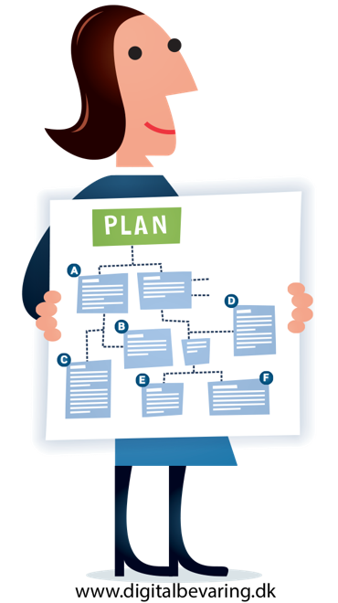

<!--

author:   Central Research Data Management of Kiel University, Britta Petersen, Linda Zollitsch

email:    zollitsch@ub.uni-kiel.de

version:  0.1.0

language: en

narrator: UK English Female

icon:     https://www.uni-kiel.de/ps/cgi-bin/logos/files/cau/norm-en/cau-norm-en-blacklila-rgb-0720.png

link: https://raw.githubusercontent.com/RDM4CAU/Intro-to-RDM/refs/heads/main/cau-style.css

comment:  This document provides a brief introduction to research data management for lecturers. It provides an overview of rdm related topics as well as some didactic and methodologies for teaching rdm to students.

-->

# How to write a data management plan?

> To see this document as an interactive LiaScript rendered version, click on the
> following link/badge:
>
> 
>
> If you have questions, please contact us: [Central Research Data Management](https://www.datamanagement.uni-kiel.de/de)
>
> This work is licenced under CC-BY (https://creativecommons.org/licenses/by/4.0/)

## Introduction

### About us

<article>
 
## Instructors
- Britta Petersen
- Linda Zollitsch
\

**Institution**

[Central Research Data Management](https://www.datamanagement.uni-kiel.de/en?set_language=en)
</article>

### Workshop rules

We hope that together we can create a pleasant, respectful working atmosphere!
---

- please don’t do anything by the side

- participate actively

- let us know, when you have questions

- let each other finish when talking

- help each other

- allow mistakes

### Warm up

**Let us play a game…**

>I will read statements to you.
>
>Each time you can agree with the statement please stand up.
>
>
>That's it !

### Orientation
\
\

### Limitations

>We assume that you are familiar with… 
>
>* the most important terms and
>
>* the basic concept of research data management

{{1}}
***********

>You can find some examples of learning resources on RDM basics here:
>
>https://isis.tu-berlin.de/course/view.php?id=34606 
>
>https://www.edulabs.uni-koeln.de/goto.php?target=fold_1513&client_id=iliasedulabs 

***********

### Learning Objectives

We hope after the workshop participants...
---

* ...can name benefits and components of a DMP.

* ...can name DMP templates and tools.

* ...can name do´s and dont´s regarding the phrasing of DMP components.

* ...can name relevant CAU support services.

* ...have discussed and exchanged with peers.

## DMP Statements

### Statement 1

DMPs save time!
---

 

{{1}}
***********

>"Early planning is half the battle won!“
>
>* responsibilities defined
>
>* uniform conventions established
>
>* conflicts avoided
>
>* data loss prevented

***********

### Statement 2

DMPs save money!
---

 

{{1}}
***********

>Initial effort pays off!
>
>* targeted deployment of resources
>
>* acquire specific RDM resources
>
>* budget external services

***********

### Statement 3

DMPs become mandatory!
---

 

{{1}}
***********
>**It is true! :-)**
>
>EU: Open Research Europe. Data Guidelines: https://open-research-europe.ec.europa.eu/for-authors/data-guidelines
>
>DFG-Vordruck 54.01 DE: https://www.dfg.de/formulare/54_01/54_01_de.pdf
>
>DFG form 54.01 EN: https://www.dfg.de/formulare/54_01/54_01_en.pdf

***********

### Statement 4

DMPs are sustainable!
---

 

{{1}}
***********
A DMP contains valuable preparatory work for further requirements (ethics application, contracts) and supports subsequent communication with service providers as a kind of results catalog (e.g., for data transfer to repositories or for writing data availability statements for journals).

***********

## What is a DMP? Function & Content

{{0-1}}
***********

***********

{{1-2}}
***********

***********

### Administrative Data

{{1}}
***********

**Identification data**

* name of the funding organization

* project grant number

* project title / acronym

* principal investigator / researcher

* researcher ID (e.g. ORCID)

* contact details for DMP responsible person

* date of first DMP version

* date of last update

***********

{{2}}
***********
**Relevant guidelines / policies**

* funder requirements

* subject-specific recommendations

* institutional guidelines

* project or institute specific policy on handling research data

***********

### Data description

{{1}}
***********

**Type of research data**

* Which data types & formats are reused or generated?

* What tools or software tools will be used?

* Are existing data suitable for re-use in terms of choice of technology, formats, usage rights, licenses and metadata?

***********

{{2}}
***********

**Volume**

* Estimate the amount of data to be expected: during data analysis as well as after selection of data for permanent archiving.

* Of what size are the largest individual files?

***********

### Data documentation & quality control

{{1}}
***********
* folder and file naming conventions

* versioning

* metadata standards

* controlled vocabularies / ontologies

* supporting documentation

* virtual research environments / databases / ELAB journals

***********

### Storage & Backup

{{1}}
***********
* storage and data sharing during the project

* backup strategy

* access control according to protection requirements (e.g. GDPR)

* long-term storage according to GRP

***********

### Legal aspects

{{1}}
***********
* Data protection

* Copyright and rights of use

* Licensing law, patent law, etc.

>* **But**: currently **no legal advice** by Central Research Data Management! :-(

***********

{{2}}
***********

**Some helpful resources:**

* Checklist forschungsdaten.info (EN Version [Link](https://www.forschungsdaten.info/praxis-kompakt/english-pages/legal-issues/))

* UK Data Service Platform: Intro to legal aspects of RDM ([Link](https://www.ukdataservice.ac.uk/manage-data/legal-ethical))

***********

### Data publication

{{1}}
***********
* selection of datasets

* name of the (domain-specific) repository

* timeline of data transfer to the archive

* time of publication (embargo, if applicable)

* reason for restrictions

* selection of usage licenses

***********

### Responsibilities & Ressources

{{1-2}}
***********
**Who is responsible for RDM?**

* regulation of responsibilities

* access control

* training of project participants

* data curation / quality control

***********

{{2-3}}
***********
**Budget: What does RDM cost?**

☞ Budget at least 5% for RDM costs!
***********

{{3-4}}
***********

See:. Jasmin Böhmer. (2019, September). UBC RDM Workshop 1 - Data Management Planning (Version V2). Zenodo. http://doi.org/10.5281/zenodo.3469953 

***********

{{4}}
***********

Adopted from.: Soßna, Volker: Wie lassen sich die Kosten für das Forschungsdatenmanagement abschätzen? Folien des Service-Teams Forschungsdaten der UH / TIB, Dezember 2018. Illustrations by Jørgen Stamp. CC BY 2.5 Denmark license www.digitalbevaring.dk

***********

## Who? RDM roles

{{0-1}}
***********

***********

{{1-2}}
***********

* Data Manager

* RDM-coordinator

* Data Steward

* Data Curator

* Archivists / service provider

* Researchers

* ...

***********

{{2}}
***********

Official NFDI website: https://www.nfdi.de/?lang=en

***********

## Why? Guidelines & requirements
{{0-1}}
***********

***********

{{1}}
***********
BMBF: Individual Funding Criteria EC: [Aktionsplan FD](https://www.bmbf.de/de/aktionsplan-forschungsdaten-12553.html) german only

Horizon Europe
[HE Programme Guide, S.40](https://ec.europa.eu/info/funding-tenders/opportunities/docs/2021-2027/horizon/guidance/programme-guide_horizon_en.pdf)

[EC: Open Research Europe. Data Guidelines](https://open-research-europe.ec.europa.eu/for-authors/data-guidelines)

***********

### Guidelines (Germany)

DFG Guidelines
---

* [Guidelines for Safeguarding Good Research Practice. Code of Conduct.](http://doi.org/10.5281/zenodo.3923602)

* [Guidelines on the Handling of Research Data](https://www.dfg.de/en/research_funding/proposal_review_decision/applicants/research_data/index.html)

* [Subject-Specific Recommendations (DFG-overview)](https://www.dfg.de/en/research_funding/proposal_review_decision/applicants/research_data/index.html#anker62237395)

### Guidelines (International)

* [European Code of Conduct for Research Integrity](https://allea.org/wp-content/uploads/2023/06/European-Code-of-Conduct-Revised-Edition-2023.pdf)

* Research Integrity Statements

* [Cape-Town Statement](https://www.wcrif.org/guidance/cape-town-statement)

* [Singapore Statement](https://www.wcrif.org/statement)

### Guidelines (Kiel University)
{{0}}
***********
What about relevant guidelines at Kiel University?
---
***********

{{1}}
***********
**Kiel University:**

* [Guideline on the handling of research data](https://www.praesidium.uni-kiel.de/de/dokumente/leitlinie-zum-umgang-mit-forschungsdaten-guideline-on-research-data-management-english)

* [Guideline Good Scientific Practice](https://www.uni-kiel.de/fileadmin/user_upload/forschung/integritaet-ethik/downloads/cau-guidelines-good-scientific-practice.pdf)

* [Example for a project specific guideline: CRC 1461 Research Data Management Guide](https://www.tf.uni-kiel.de/crc1461rdm/)

**********

### FAIR Principles

{{1}}
***********

FAIR concentrates on how to prepare data in a sustainable way that it can be found and used by others.

Research data are **FAIR** if they are made

- findable,

- accessible (i.e., at least metadata can be accessed),

- interoperable,

- and reusable.

FAIR-checklist: Jones, Sarah, & Grootveld, Marjan. (2017, November). How FAIR are your data?. Zenodo. http://doi.org/10.5281/zenodo.3405141 

*******

## How? Templates & Tools

### DMP templates
{{0-1}}
***********

> **So, how to start...? Use templates!**

***********

{{1-3}}
***********

**Templates**

* [CAU-template](https://www.datamanagement.uni-kiel.de/de/service/materialien)

* [DFG Checklist (for section 2.4 of the proposal)](https://www.dfg.de/download/pdf/foerderung/grundlagen_dfg_foerderung/forschungsdaten/forschungsdaten_checkliste_en.pdf)

* [Volkswagen Stiftung Basic DMP (rtf-File)](https://www.volkswagenstiftung.de/sites/default/files/documents/2022-04_basic_data_management_plan.rtf)

* [EU Horizon Europe-Template](https://fdm.uni-koeln.de/sites/FDM-UzK/Templates/data-management-plan-template_he_en-2.docx)

* [Science Europe Template](https://www.scienceeurope.org/our-priorities/research-data/research-data-management/)

***********

{{2-3}}
***********

**Examples**

* [DFG Sample (CMS / HU Berlin)](https://cms.hu-berlin.de/de/ueberblick/projekte/dataman/muster-dmp-dfg)

* [BMBF Sample (CMS / HU Berlin)](https://www.cms.hu-berlin.de/de/dl/dataman/muster-dmp-bmbf)

* [Zenodo published DMPs (uncurated list)](https://zenodo.org/search?q=DMP&f=subject:DMP&l=list&p=1&s=10&sort=bestmatch)

***********

{{3-4}}
***********

**Based on the Research Data Lifecycle**

* [DFG Checklist](https://www.dfg.de/download/pdf/foerderung/grundlagen_dfg_foerderung/forschungsdaten/forschungsdaten_checkliste_de.pdf)

* [Science Europe Template (engl.)](https://www.scienceeurope.org/our-priorities/research-data/research-data-management/)

***********

{{4-5}}
***********
**Based on the FAIR-Principles**

* [EU Horizon Europe-Template](https://fdm.uni-koeln.de/sites/FDM-UzK/Templates/data-management-plan-template_he_en-2.docx)

***********

{{5-6}}
***********

***********

{{6-7}}
***********

Science Europe Template & Practical Guide https://www.scienceeurope.org/our-priorities/research-data/research-data-management/ 

***********

{{7}}
***********

Usually linked in the EU Funding & tenders portal.
Alternative LINKs: 
https://fdm.uni-koeln.de/sites/FDM-UzK/Templates/data-management-plan-template_he_en-2.docx 
https://enspire.science/wp-content/uploads/2021/09/Horizon-Europe-Data-Management-Plan-Template.pdf 

***********

### DMP tools

{{1}}
***********
**Generic DMP-Tools**

[Research Data Management Organizer (RDMO) - DFG-funded](https://rdmorganiser.github.io/)

[DMPonline - Digital Curation Centre (DDC), hosted by University of Edinburgh](https://dmponline.dcc.ac.uk/)

[DMP Tool - California Digital Library](https://dmptool.org/)

***********

{{2}}
***********
**Subject-specific DMP tools**

* biodiversity and environmental research: [GFBio DMP-Tool](https://www.gfbio.org/plan)

* humanities & social sciences / language data: [CLARIN-D Wizard](https://www.clarin-d.net/de/aufbereiten/datenmanagementplan-entwickeln)

* geosciences: [MOSES DMP tool](https://moses-dmp.gfz-potsdam.de/) - prototype under development

* psychology: [DataWiz](https://datawiz.leibniz-psychology.org/DataWiz/)

* educational research: standardized DMPs ([STAMP](https://www.forschungsdaten-bildung.de/stamps-nutzen) soon available with RDMO tool or pdf file)
***********

## Excercise

**Task**

>Review excerpts from DMPs (one excerpt per group)
>
>Discuss the particular example – what do you notice?
>
> **Time: 10 minutes**

### Example 1

{{0}}
***********

***********

{{1}}
***********

***********

### Example 2

{{0}}
***********

***********

{{1}}
***********

***********

### Example 3

{{0}}
***********

***********

{{1}}
***********

***********

## Do's & Don'ts

{{0}}
***********

***********

### Common mistakes in DMP writing:

* lack of accuracy

* reuse of text blocks

* terminological inaccuracies

* lack of resource calculation

### DMP checklist

1. Determine the Research Sponsor Requirements

2. Identify the Data to Be Collected

3. Define How the Data Will Be Organized

4. Explain How the Data Will Be Documented

5. Describe How Data Quality Will Be Assured

6. Present a Sound Data Storage and Preservation Strategy

7. Define the Project’s Data Policies

8. Describe How the Data Will Be Disseminated

9. Assign Roles and Responsibilities

10. **Prepare a Realistic Budget**

Michener WK (2015) Ten Simple Rules for Creating a Good Data Management Plan. PLoS Comput Biol 11(10): e1004525. 
https://doi.org/10.1371/journal.pcbi.1004525 

## CAU Services

{{0-1}}
***********

website: https://www.datamanagement.uni-kiel.de/en?set_language=en 

e-mail: info@fdm.uni-kiel.de  

***********

{{1-2}}
***********
**Consultation**

* proposal consulting

* data strategy development

* DMP consulting

* technical consulting (storage, backup, tools, etc.)

* support for peer reviews

* assistance with data publication
***********

{{2-3}}
***********
**Training & Teaching support**

* workshops

 * via Graduate Center, Continuing Professional Development Center
 * small groups
 * different target groups
 * general RDM basics
 * Specialization, e.g. Introduction to Git (on demand)

* teaching support on demand
***********

{{3-4}}
***********
**RDM Infrastructure**

* RDM services

* consulting on tools and services

* contact with specialist departments of the CAU
***********

{{4-5}}
***********
**Networking**

* local networking at CAU via [AG FDM](https://www.datamanagement.uni-kiel.de/en/networking?set_language=en)

* regional networking via [FDM-SH](https://fdm-sh.de/)

* active networking in different relevant national working groups (e. g. NFDI, DINI/nesor AG Forschungsdaten, GoFAIR)

* International networking: e. g. RDA
***********

{{5-6}}
***********
**Contact**

Feel free to contact us:

>**DMP Consulting:**
>
>Thilo Paul-Stüwe
>paul-stueve@rz.uni-kiel.de
>
>Andreas Christ
>christ@ub.uni-kiel.de 

>**Workshops & teaching support:**
>
>Britta Petersen
>b.petersen@rz.uni-kiel.de 
>
>Linda Zollisch 
>zollitsch@ub-uni-kiel.de

***********

## Acknowledgement

This workshop material is fully based on 

Schenk, Jasmin & Mühlichen Andreas: „How to write a data management plan?“
[Cologne Competence Center for Research Data Management (C3RDM)](https://fdm.uni-koeln.de/home)
Universität zu Köln

Thanks a lot for sharing! 🥰
---