<!--

author:   Central Research Data Management of Kiel University

email:  info@fdm.uni-kiel.de

version:  0.1.0

language: de

narrator: Deutsch Male

icon:     https://www.uni-kiel.de/ps/cgi-bin/logos/files/cau/norm-en/cau-norm-en-blacklila-rgb-0720.png

link: https://raw.githubusercontent.com/RDM4CAU/Intro-to-RDM/refs/heads/main/cau-style.css

comment:  Dieses Dokument enthält eine kurze Anleitung zur Nutzung des webbasierten RDMO-Tools, gehosted von forschungsdaten.info

-->

# RDMO Kurzanleitung

>Der __R__esearch __D__ata __M__anagement __O__rganiser (RDMO) ist eine Webapplikation zum Erstellen von Datenmanagementplänen. RDMO führt Nutzende anhand eines Interviews durch alle wichtigen Aspekte des Datenmanagements. Antworten können anschließend in verschiedenen Dateiformaten ausgegeben werden.
>
>Es existieren bundesweit verschiedene Instanzen RDMO. Diese Kurzanleitungen erläutert die Nutzung von [RDMO auf forschungsdaten.info](https://rdmo.forschungsdaten.info/).

>💡 __Hinweis__: Exportieren Sie Ihre Daten möglichst nach jeder Arbeitssitzung, um Datenverluste zu vermeiden!

## Zugriff

Öffnen Sie die Startseite der RDMO-Instanz in einem beliebigen Browser:

👉 https://rdmo.forschungsdaten.info/

## Anmeldung

Für die Nutzung des RDMO-Tools ist eine Anmeldung erforderlich.

---

{{0}}
**********
1. Klicken Sie auf die Schaltfläche `NFDI AAI with Unity`. Diese befindet sich im unteren Drittel der Seite auf der rechten Seite.

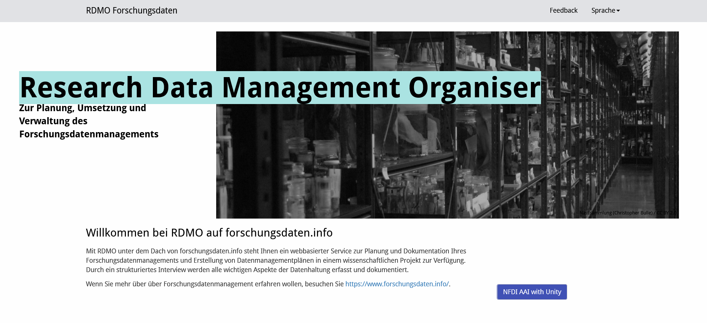

---

**********

{{1}}
**********
2. Sie werden zu dem Authentifizierungsdienst der Helmholzgesellschaft weitergeleitet (Helmholtz AAI). Über diese ist eine Anmeldung mit Ihrer institutionellen ID und dem zugehörigen Passwort möglich. Geben Sie im Suchfeld `Christian-Albrechts-Universität` ein oder scrawlen Sie durch die Liste und wählen Sie die CAU aus, in dem Sie auf den entsprechenden Schriftzug klicken.

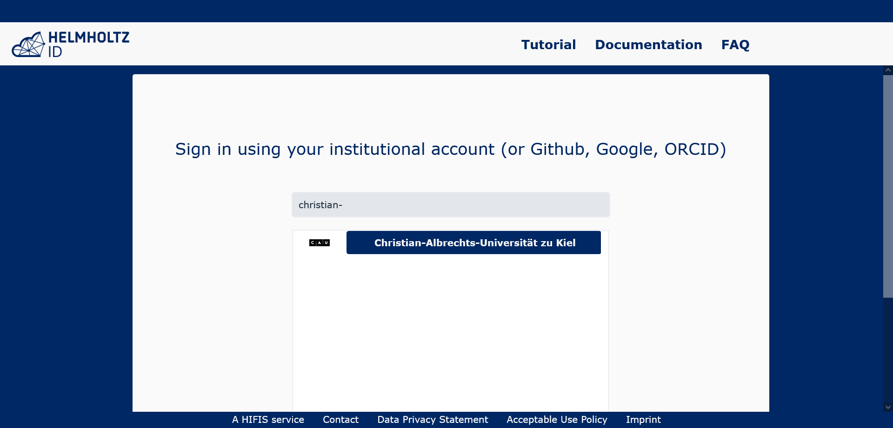

---

**********

{{2}}
**********
3. Geben Sie Ihre institutionelle Kennung (z. B. subib221, suzuv109) und das zugehörige Passwort ein.

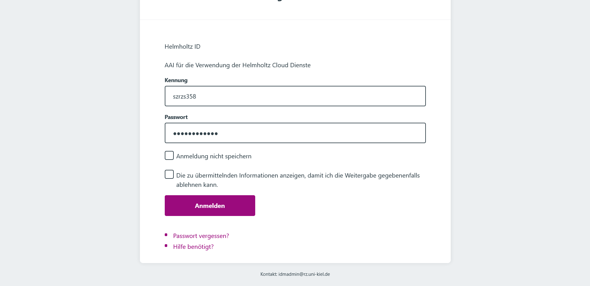

---

**********

{{3}}
**********
>💡 __Hinweis__: Sollte das Einloggen mit Ihrer institutionellen ID nicht funktionieren, können Sie sich alternativ auch mit Ihrer [ORCID-ID](https://orcid.org/), Ihrer Github- oder Ihrer Google-ID an dem System anmelden.
>
>In diesem Fall bittet das System Sie automatisch um eine Registrierung. Folgen Sie den Anweisungen des Systems. Sie erhalten anschließend eine E-Mail mit dem Betreff "Helmholtz ID e-mail confirmation request". Bestätigen Sie Ihre Registrierung, indem Sie auf den entsprechenden Link in der E-Mail klicken. Nach Abschluss der Registrierung melden Sie sich via ORCID-, Github-, oder Google-ID an.

---
**********

## Projekt anlegen

Nach dem ersten Login landen Sie in Ihrer noch leeren Projektliste.
Um einen Datenmanagementplan zu erzeugen, müssen Sie zunächst ein Projekt in RDMO anlegen:

---

1. Klicken Sie auf das Feld `+ Neues Projekt` am oberen rechten Bildrand.

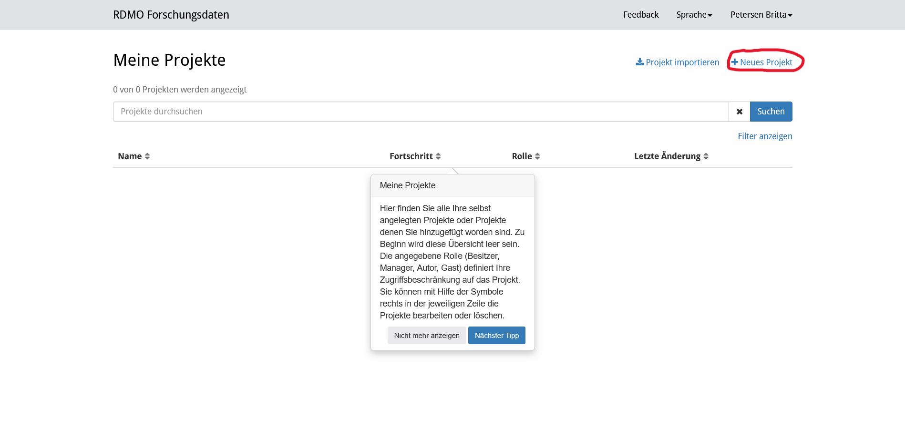

---

2. Geben Sie dem Projekt einen „Titel“ und tragen Sie eine kurze Beschreibung des Projektes ein (optional).

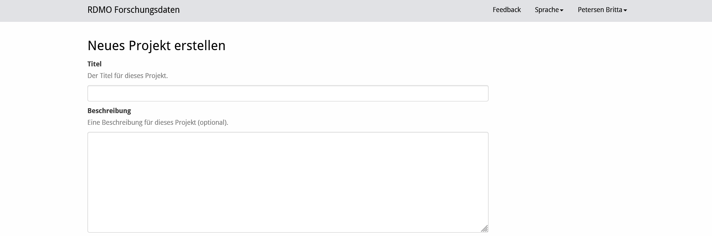

---

3. Unterhalb des Seitenbereiches, in dem Titel und Beschreibung angegeben werden, befindet sich ein mit __Katalog__ überschriebener Bereich. Hier können Sie aus einer Single-Choice-Liste den passenden Fragebogen für Ihr Projekt auswählen. Sie können den Katalog zu einem späteren Zeitpunkt jederzeit wechseln.

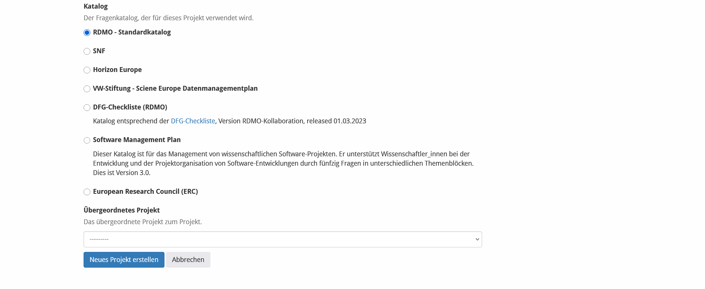

---

5. Optional: Wählen Sie ein übergeordnetes Projekt, um dessen Inhalte zu übernehmen.

---

6. Klicken Sie unten links auf die Schaltfläche `Neues Projekt erstellen`.

---

7. Ihr neues Projekt wurde erstellt und Sie befinden sich jetzt in der Projekt-Übersicht:

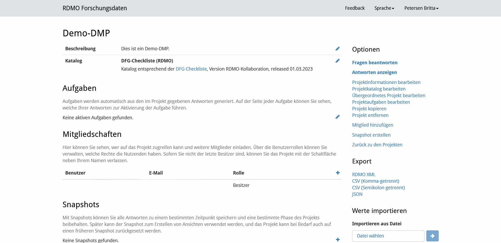

---

## Fragenkatalog ausfüllen

Das RDMO-Tool führt Sie mit einem strukturierten Interview durch den zuvor gewählten Fragenkatalog.

---

1. Öffnen Sie die Projekt-Übersicht.

---

2. Auf der rechten Seite befindet sich ein Menü. Wählen Sie dort die erste Option “Fragen beantworten”.

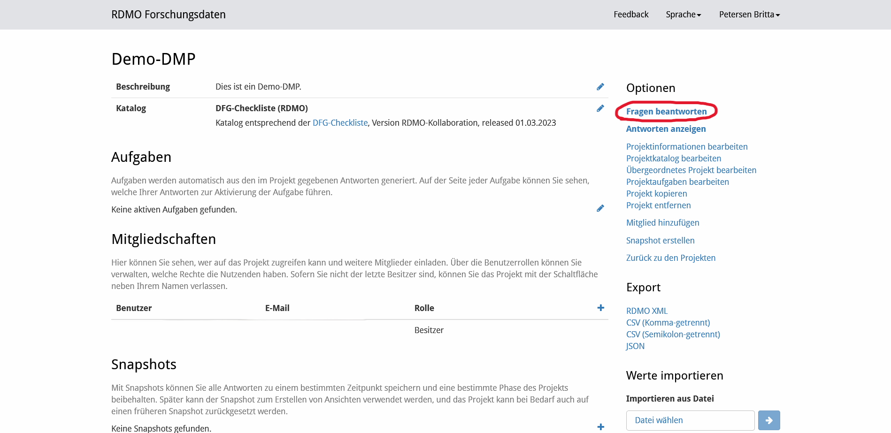

---

3. Das Interview startet. Sie können jede Frage, auf die Sie zum entsprechenden Zeitpunkt noch keine Antwort haben, oder die im Allgemeinen für Ihr Forschungsvorhaben irrelevant erscheint, überspringen und ggf. zu einem späteren Zeitpunkt beantworten. Die Übersicht am rechten Rand ermöglicht die schnelle Navigation zwischen den Themen.

    💡 __Hinweis__: Wenn Sie auf “Fortfahren” klicken, springen Sie zum nächsten Thema, auch wenn Sie die Fragen für jeden Datensatz nicht vollständig beantwortet haben.

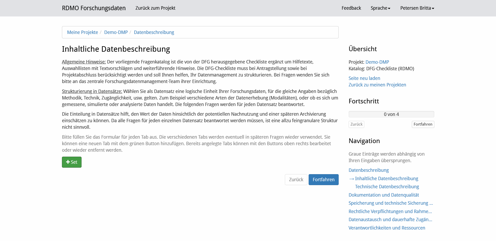

---

4. Navigieren Sie durch die Abschnitte.

---

5. Beantworten Sie die Fragen Schritt für Schritt.

---

6. 💡 __Hinweis__: Speichern Sie regelmäßig!

---

## Anworten ansehen & exportieren

RDMO erlaubt über Templates die Ausgabe von Datenmanagementplänen und Textbausteinen für Förderanträge. Diese "Ansichten" können Sie in verschiedene Textformate zur weiteren Bearbeitung exportieren.

---

1. Öffnen Sie die Projekt-Übersicht.

---

2. Auf der rechten Seite befindet sich ein Menü. Klicken Sie dort auf die zweite Option “Anworten anzeigen”.

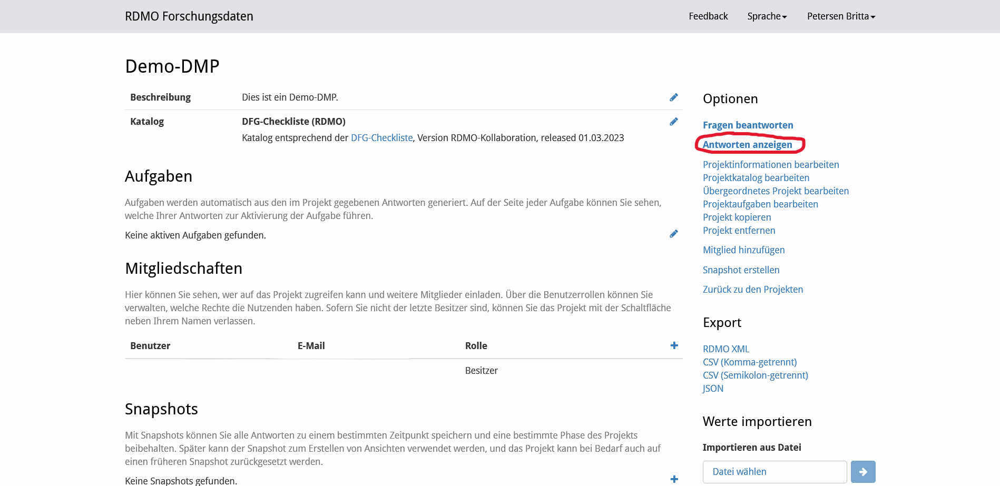

---

3. Im folgenden Fenster sehen Sie die entsprechende Ausgabe. Über das rechte Menü können Sie die Datei in verschiedene Formate für die Nachbearbeitung exportieren (u.a. Open Office, Microsoft Word, LaTeX, rtf, pdf).

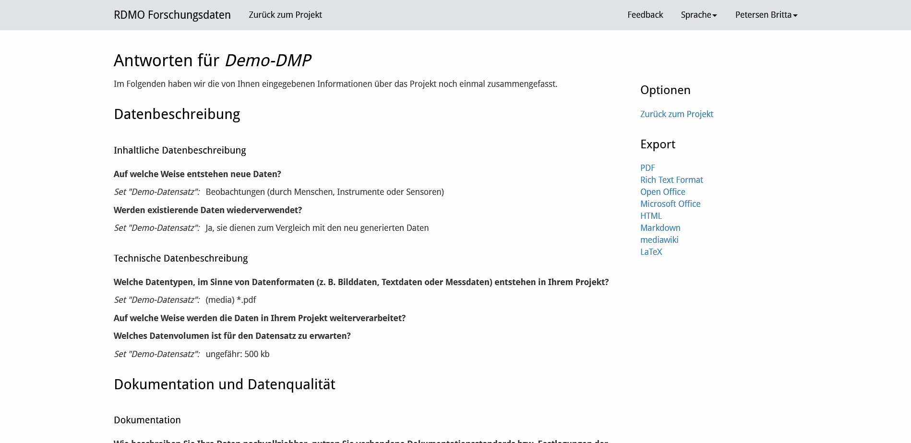

>💡 __Hinweis__: Exportieren Sie Ihre Daten möglichst nach jeder Arbeitssitzung, um Datenverluste zu vermeiden!

--- 

## Fragenkatalog ändern

Sie können jederzeit den Fragenkatalog ändern.

---

1. Öffnen Sie die Projekt-Übersicht.

---

2. Klicken Sie auf das Stift-Symbol rechts neben den Angaben zum Katalog.

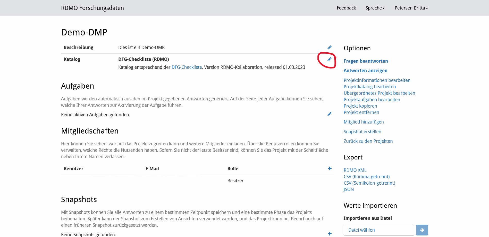

---

3. Wählen Sie aus der Liste einen anderen Fragebogen aus und klicken Sie auf die Schaltfläche `Projekt speichern`.

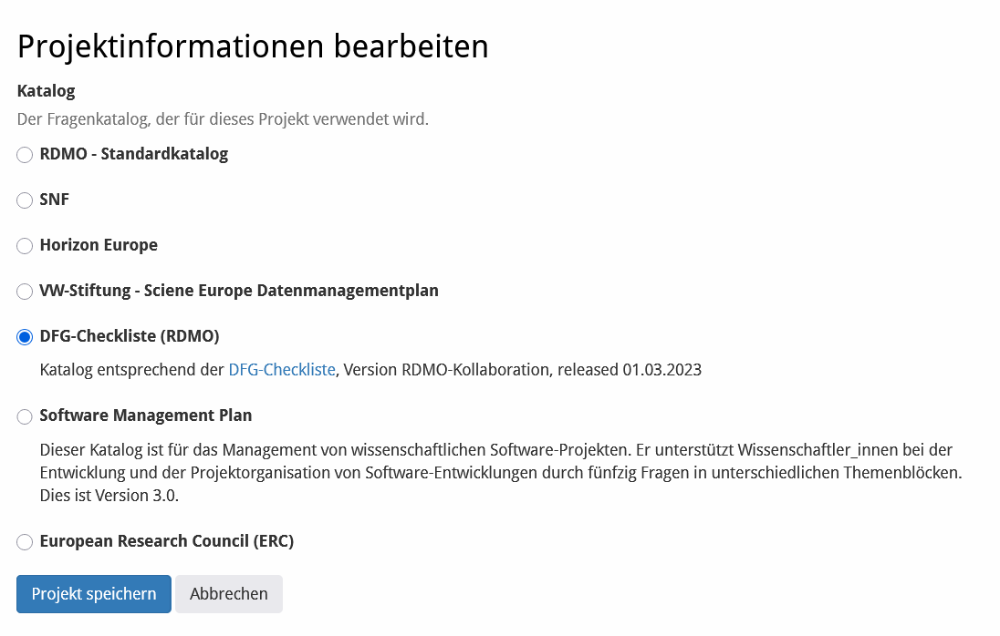

---

## Zusammenarbeit

Sie können Ihren RDMO-Projekten Projektmitglieder hinzu fügen und diesen verschiedene Rollen und Rechte zuweisen.

---

1. Öffnen Sie die Projekt-Übersicht

---

2. Navigieren Sie zu dem Abschnitt "Mitgliedschaften"

---

3. Fügen Sie Mitglieder hinzu, indem Sie auf das Pluszeichen am rechten Rand klicken und im folgenden Dialog den Benutzernamen (wenn sie bereits ein Konto hier haben), oder die E-Mail-Adresse der Person, die Sie hinzufügen möchten, eingeben.

---

4. Sie können neuen Mitgliedern jeweils eine der folgenden Rollen zuweisen: Gast (kann nur lesen), Autor (kann Fragen beantworten), Manager (kann zusätzlich Snapshots erstellen, das Projekt exportieren, Werte importieren und die Projekteinstellungen aktualisieren) oder Besitzer (wie Sie).

---

5. Klicken Sie auf die Schaltfläche `Mitglied einladen`. Die Eingeladenen erhalten eine E-Mail mit einem Link zum Beitritt zum Projekt mit der zugewiesenen Rolle.

---

## Snapshots

Snapshots speichern Ihre Antworten zu einem bestimmten Zeitpunkt. Sie können somit verschiedene Versionen Ihres Projekts anlegen und regelmäßig aktualisierte Fassungen erstellen, wie es beispielsweise im Rahmen von Horizon2020-Projekten verlangt wird. Bei Bedarf kann ihr Projekt auch auf frühere Snapshots zurückgesetzt werden.

---

1. Öffnen Sie die Projekt-Übersicht.

2. Wählen Sie im rechten Menü die Option “Snapshot erstellen”.

3. Geben Sie anschließend einen Namen und ggf. eine Beschreibung ein.

4. Unter der Überschrift “Snapshots” auf der Projektseite finden Sie anschließend eine Übersicht der erstellten Snapshots inklusive Erstelldatum.

---

Snapshot anzeigen
---

Über die Snapshot-Übersicht können Sie Ihre früheren Antworten anzeigen lassen. Auch in den Ansichten können Sie zwischen aktueller und früheren Versionen umschalten.

1. Öffnen Sie die Projekt-Übersicht.

2. Scrollen Sie nach unten zur Übersicht der Snapshots.

3. Klicken Sie auf das Auge-Symbol neben dem gewünschten Snapshot, um die früheren Antworten anzuzeigen.

4. Auf der folgenden Seite können Sie im rechten Menü zwischen Snapshot und aktueller Ansicht umschalten.

Snapshot wiederherstellen
---

Sie können frühere Versionen nicht nur anzeigen lassen, sondern auch das Projekt auf diese zurücksetzen.

>Warnung: Wird ein früherer Snapshot wiederhergestellt, gehen alle bisherigen Änderungen verloren.

1. Navigieren Sie zur Übersicht der Snapshots.

2. Klicken Sie auf den Pfeil in den Bearbeitungsoptionen, um einen Snapshot wiederherzustellen.

3. Bestätigen Sie die Wiederherstellung.